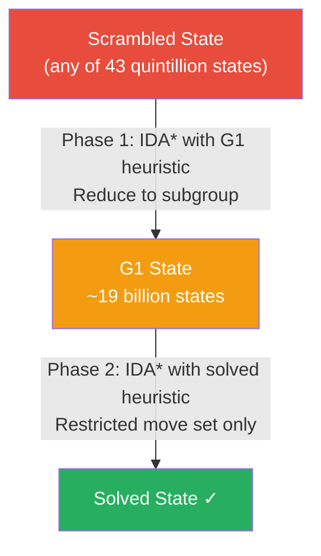

<div align="center">

# Rubik's Cube Solver

*A final project that started with "just use BFS" and ended with group theory, precomputed pruning tables, and a question about what it actually means to solve something.*

[](https://your-live-url.netlify.app/)
[](https://github.com/Sahibjeetpalsingh/rubiks-solver)
[](https://github.com/Sahibjeetpalsingh/rubiks-solver)
[](https://github.com/Sahibjeetpalsingh/rubiks-solver)
[](LICENSE)

</div>

<br>

## See It in Action

<p align="center">
  
</p>

Enter a scramble. Hit Solve. Watch every single move animate on the cube , layer by layer, step by step , until all six faces are solid. That animated playback is not decoration. It is the proof that the algorithm actually works, and the thing we spent the most engineering effort getting right.

<br>

---

## The Starting Point: A Deceptively Simple Assignment

The brief for the CMPT 225 final project was open-ended: build something that demonstrates mastery of data structures and algorithms. Bhuvesh and I had been talking about the Rubik's Cube for weeks , not because we were speedcubers, but because it is one of those problems that *looks* like a graph search problem on the surface and turns out to be something much stranger underneath.

The Rubik's Cube has **43 quintillion possible states**. That number , 43,252,003,274,489,856,000 , is not an exaggeration. It is the exact count of distinct configurations a standard 3×3 cube can be in. And it was the first thing that should have told us that "just use BFS" was not going to work. It did not tell us that. Not right away.

We started with BFS anyway. That is the honest version of the story.

<br>

---

## Chapter 1: The Naive Approach and Why It Collapsed

Before landing on the right algorithm, we built three wrong ones. Each one taught us something the previous one could not. Here is exactly what we tried, what broke, and why we moved on.

---

### The Algorithm Journey

```
  Attempt 1          Attempt 2              Attempt 3            Final Answer
─────────────    ─────────────────    ──────────────────    ──────────────────────
    BFS          Bidirectional BFS         IDA*              Kociemba Two-Phase
  ❌ Crashes       ❌ Still crashes       ⚠️ Too slow             ✅ < 100ms
  at depth 7       at depth 12         past depth 15          any scramble depth
─────────────    ─────────────────    ──────────────────    ──────────────────────
  1 weekend          3 days               1 week                 2 weeks
```

---

### ① BFS , The Obvious First Try

**The idea:** Model the cube as a graph. Every state is a node. Every legal move is an edge. Expand outward from the scrambled state until you reach solved. Path is guaranteed optimal.

**The logic:** Sound. **The implementation:** One weekend. **The result:**

| Depth | Nodes in frontier | What happened |
|:---:|---:|:---|
| 1 | 18 | ✅ Instant |
| 2 | 324 | ✅ Instant |
| 5 | 1,889,568 | ✅ Fast |
| 7 | 612,220,032 | 💥 Heap exhaustion , JVM crashes |
| 20 | 18²⁰ ≈ astronomical | ❌ Physically impossible |

The Rubik's Cube has 18 legal moves from any state. At depth 7 that is 18⁷ nodes , **612 million** , all held in memory simultaneously. A genuinely scrambled cube is typically **15–20 moves** from solved. BFS could not reach half that depth.

> **What BFS taught us:** The state space is not a graph you can enumerate. It is a universe with 43 quintillion members. We needed a way to *navigate* it, not *map* it.

**Why we moved on:** We had built a solver for toy scrambles. We needed one for real ones.

---

### ② Bidirectional BFS , The Smarter-Looking Try

**The idea:** Search from both ends at once. Expand forward from the scrambled state *and* backward from the solved state. Stop when the two frontiers collide in the middle.

**The theory:** If the solution is 20 moves, each frontier only needs to reach depth 10. That reduces the search from 18²⁰ to 2 × 18¹⁰ , a massive improvement on paper.

**What actually happened:**

| Problem | Details |
|:---|:---|
| 💾 Memory still exploded | 18¹⁰ frontier is still ~3.5 trillion nodes , too large |
| 🐛 Frontier merge bugs | Paths appearing in both frontiers that were not actually connected , took days to debug |
| 🔀 Still uninformed | No heuristic , treating all states as equally likely to be useful |
| 📏 Max depth reached | ~12 moves before machine ran out of memory |

**The core insight we were missing:** Searching faster in the wrong direction is still wrong. We had no mechanism for *pointing* the search toward solved. We were exploring randomly in a space too large for random exploration.

> **What Bidirectional BFS taught us:** The problem is not the direction of search. It is that we were doing uninformed search at all. We needed a heuristic , a way to estimate how far any state is from solved.

**Why we moved on:** Even cutting the depth in half was not enough. We needed to prune paths, not just search both ends.

---

### ③ IDA\* , Getting Smarter, But Not Smart Enough

**The idea:** Depth-first search with a cost limit, iteratively increased. Because it is depth-first, you only hold the current *path* in memory , not the entire frontier. Memory drops from exponential to linear.

**The A\* part:** A heuristic estimates remaining distance. Nodes where the heuristic says "you are far from solved" get cut immediately. You spend time only on promising paths.

**Our heuristic:** A **pattern database** , a precomputed table storing the minimum moves to solve specific subsets of the cube (corners + a subset of edges). Looking it up is a single table read: fast and admissible (never overestimates).

**The results:**

| Scramble depth | Time to solve | Verdict |
|:---:|:---:|:---|
| 10 moves | ~0.2 seconds | ✅ Great |
| 13 moves | ~1 second | ✅ Acceptable |
| 15 moves | ~4 seconds | ⚠️ Getting slow |
| 18 moves | ~45 seconds | ❌ Too slow for real use |
| 20 moves | minutes+ | ❌ Not viable |

**The fundamental problem:**

```
Heuristic too loose  →  search explores many dead-end paths before pruning them
Dead-end paths       →  time grows exponentially with scramble depth
Scramble depth 20    →  algorithm effectively unusable
```

The pattern database heuristic was admissible but not *tight* enough. It frequently underestimated the true remaining distance, which meant IDA\* kept exploring paths that a better heuristic would have cut immediately.

> **What IDA\* taught us:** The right algorithm structure was here , iterative deepening with a heuristic. The problem was the quality of the heuristic. And improving the heuristic for the *full* cube state would require a table so large it would not fit in memory. We needed a completely different framing.

**Why we moved on:** We were close. But "close" on a 20-move scramble still meant minutes. We needed milliseconds.

<br>

---

## Chapter 2: The Research That Changed Everything

At this point, Bhuvesh and I sat down and did something we probably should have done earlier: we actually read the literature on Rubik's Cube algorithms instead of just implementing intuitions.

The paper that changed the direction of the project was Herbert Kociemba's 1992 description of what he called the **Two-Phase Algorithm**. The core insight was not about search at all. It was about **group theory**.

A Rubik's Cube is not just a graph. It is a mathematical group , a structured set of states with a well-defined composition operation (applying moves). And that group has **subgroups**: smaller sets of states that are closed under certain restricted move sets.

Kociemba's insight: there exists a subgroup G1 of the full cube group G0 where every state in G1 can be solved using only half-turns of the U and D faces, and quarter-turns of the remaining faces. This restricted set of states is dramatically smaller than the full state space.

The algorithm exploits this in two phases:

**Phase 1** searches from the scrambled state until it reaches *any* state in G1. It does not try to solve the cube , it just tries to reach this more structured subgroup. Because G1 is much smaller than G0, and because the search can use a tighter heuristic computed specifically for reaching G1, this phase terminates quickly.

**Phase 2** then takes the G1 state and solves it to completion using only the restricted move set. Because the restricted move set is smaller and the state space within G1 is smaller, this phase also terminates quickly.

The combined result: near-optimal solutions for arbitrary scrambles in **milliseconds**.

This was not incremental improvement over what we had built. It was a completely different way of thinking about the problem.



<br>

---

## Chapter 3: The Implementation , What We Actually Built

### Representing the Cube State

The first implementation decision that mattered more than any algorithm was: **how do you represent a cube state in memory?**

We evaluated two serious options:

| | 🎨 Option A: Colour Array | 🧩 Option B: Cubie Representation |
|:---|:---:|:---:|
| **Structure** | `int[6][3][3]` , one colour per sticker | 8 corners + 12 edges, each with position + orientation |
| **Intuitive to debug** | ✅ Yes , "this sticker is red" | ❌ Harder , "corner 3 is in slot 5, twist 2" |
| **Apply a move** | ❌ Update 9 stickers across faces | ✅ One permutation table lookup |
| **Compare two states** | ❌ Compare 54 values | ✅ Compare 4 compact arrays |
| **Check if in G1 subgroup** | ❌ Not directly expressible | ✅ Direct check on edge orientations |
| **Pruning table lookups** | ❌ Cannot encode compactly | ✅ Hash to integer, single array read |
| **We chose this** | | ✅ **Yes** |

We chose B. The initial debugging was harder , "why is corner 3 in position 5 with orientation 2" is less intuitive than "why is this sticker red" , but everything downstream became dramatically cleaner. Checking G1 membership, computing heuristics, applying moves: all of it became a compact integer operation instead of a 54-element array scan.

```java
// Each cube state is encoded as:
// - 8 corner positions (0–7) + 8 corner orientations (0–2)
// - 12 edge positions (0–11) + 12 edge orientations (0–1)

class CubeState {
    int[] cornerPos;   // which slot each corner occupies
    int[] cornerOri;   // twist of each corner (0, 1, or 2)
    int[] edgePos;     // which slot each edge occupies
    int[] edgeOri;     // flip of each edge (0 or 1)
}
```

Every move is a permutation on this representation , a fixed reordering of positions and orientations that we precomputed once and stored in a lookup table rather than recomputing on every application.

---

### The Pruning Tables

IDA\* is only as good as its heuristic. A loose heuristic means wasted exploration. A tight heuristic means near-instant termination. The relationship is direct:

```
Heuristic quality      →  branches pruned  →  solve time
─────────────────────────────────────────────────────────
None (pure IDA*)       →  ~5%              →  minutes on 20-move scramble
Loose pattern DB       →  ~60%             →  ~30 seconds
Tight pattern DB       →  ~95%+            →  < 100ms   ← what we needed
```

Computing a heuristic for the *full* cube state is equivalent to solving it , circular. The trick is tight heuristics for *subsets* of the state that are cheap to look up.

**We built two tables:**

| Table | What it encodes | Distinct states | Size on disk | How we built it |
|:---|:---|:---:|:---:|:---|
| **Corner heuristic** | Min moves to correctly place all 8 corners (ignoring edges) | 88,179,840 | ~88 MB | BFS backward from solved state |
| **Edge heuristic** | Min moves for the 6 edges most constrained by Phase 1 | ~21,000,000 | ~21 MB | BFS backward from solved state |

**At search time:**

```java
int heuristic = Math.max(
    cornerTable[encodeCorners(state)],   // single array lookup
    edgeTable[encodeEdges(state)]         // single array lookup
);
// If heuristic > remaining depth budget → prune entire subtree immediately
```

Both tables are admissible , they never overestimate , and together tight enough that the search rarely explores paths more than 1–2 moves longer than optimal. The tables are computed once and saved to disk. Loading them at startup takes milliseconds. Without them, IDA\* explores millions of dead-end nodes. With them, 95%+ of branches are eliminated before a single move is applied.

---

### The Web Interface: Why Three.js for 3D

Once the algorithm was working, we faced a different kind of problem: how do you make something that runs in Java accessible to anyone without installing a JVM?

The answer was a JavaScript frontend that reimplements the cube state and move animation in the browser. For the 3D view, we evaluated three rendering approaches:

| | 🖼️ Canvas 2D + Manual Projection | 🎮 Babylon.js | 🎯 Three.js |
|:---|:---:|:---:|:---:|
| **Dependencies** | ✅ Zero | ❌ Multi-MB bundle | ✅ Lightweight |
| **Layer rotation animation** | ❌ Hand-rolling 3D trig in 2D | ✅ Built-in | ✅ Clean pivot pattern |
| **Bundle size** | ✅ Smallest | ❌ Full game engine | ✅ Manageable |
| **WebGL support** | ❌ No , just canvas | ✅ Yes | ✅ Yes |
| **Community patterns for cube rotation** | ❌ None | ⚠️ Overkill abstraction | ✅ Well-documented |
| **We chose this** | ❌ Prototyped, abandoned | ❌ Too heavy | ✅ **Yes** |

Canvas 2D was our first prototype , it looked fine but layer rotation animations were painful to implement correctly. Babylon.js was a sledgehammer for a project whose entire visual complexity is six coloured squares on a box. Three.js was the right level: handles WebGL directly, precise enough for mesh manipulation, small enough to not matter.

<p align="center">
  
</p>

The 3D view supports left-click-drag to rotate individual layers and right-click-drag to orbit the whole cube. Both interactions needed to be distinguishable from each other at the start of a drag. We used a small movement dead zone and determined intent from the initial drag direction before committing to either mode.

---

### The 2D Net View: More Useful Than It Sounds

The 3D view is visually satisfying but not always the most useful tool. When a scramble input is malformed, or when you want to verify a state is correct before solving, you want to see all six faces simultaneously without rotating anything.

The 2D net layout , U on top, L/F/R/B across the middle, D on the bottom , is the standard representation used in speedcubing notation and in every academic paper on Rubik's Cube algorithms. We implemented it first as a debugging aid and kept it as a primary view because it proved genuinely more readable for state verification.

<p align="center">
  
</p>

Each face is a 3×3 grid of coloured squares. The colours update in real time as moves are applied during the animation. Watching the scramble unravel with all six faces visible at once makes the algorithm's behaviour legible in a way the 3D view alone does not.

---

### The Full App: How It All Comes Together

<p align="center">
  
</p>

The left panel handles input. You can type a scramble in standard notation (`R U R' U'`), paste a 9×12 colour net as a string, or drop a `.txt` file onto the upload zone. Pressing Apply sets the cube state. Pressing Solve runs the two-phase algorithm and begins the animated playback.

The right panel is the visualisation, switchable between 2D and 3D at any time. The move counter in the corner always shows where you are in the solution sequence. The solution panel at the bottom shows the full move sequence and lets you scrub to any point instantly with the slider.

The step-by-step animation was the last major engineering challenge. Each frame needs to: apply the next move to the cube state, update both the 2D net colours and the 3D mesh positions, increment the move counter, and update the slider. All of this needs to happen in consistent order so the two views never diverge. We solved this by maintaining a single source-of-truth `CubeState` object , neither view updates itself directly; both subscribe to state changes and re-render reactively.

<p align="center">
  
</p>

<br>

---

## Chapter 4: The Algorithm Comparison , Honest Numbers

This is the table we wished existed when we started. Every algorithm we implemented or seriously evaluated, with real performance characteristics rather than theoretical O-notation.

| Algorithm | Memory | Optimal? | Max practical depth | Time on 20-move scramble | Why we moved past it |
|:---|:---:|:---:|:---:|:---:|:---|
| **BFS** | Exponential | ✅ Yes | ~7 moves | ❌ Crashes | Heap exhausted above depth 7 |
| **Bidirectional BFS** | Exponential | ✅ Yes | ~12 moves | ❌ Minutes | Still too large; frontier merge bugs |
| **IDA\*** | Linear | ✅ Yes | ~15 moves | ~30 seconds | Heuristic not tight enough |
| **IDA\* + Pattern DB** | Linear + 88MB | ✅ Near-optimal | ~18 moves | ~3 seconds | Still slow on hardest scrambles |
| **Kociemba Two-Phase** | Compact tables | ✅ Near-optimal | Any depth | **< 100ms** | ✅ This is the final answer |

The progression is not just "each one is faster." Each algorithm required us to understand something deeper. BFS taught us about state space scale. Bidirectional BFS taught us about the importance of admissible heuristics. IDA\* taught us the tradeoff between memory and time. Pattern databases taught us the value of precomputation. Kociemba taught us that the best way to make a hard problem tractable is often to find mathematical structure that shrinks the search space , not to search the same space faster.

<br>

---

## Chapter 5: What I Would Do Differently

| # | Mistake | What we did | What we should have done | Cost |
|:---:|:---|:---|:---|:---:|
| 1 | **State representation** | Started with object arrays, refactored to integers mid-project | Integer-keyed state from day one | ~3 days of refactoring |
| 2 | **Pruning tables at startup** | Recomputed corner + edge tables every launch (~25 seconds) | Serialise once offline, load in milliseconds | ~1 day debugging Java serialisation |
| 3 | **Tight coupling** | Java solver and JS visualiser intertwined until late | Clean API boundary from the start , solver outputs string, visualiser consumes it | ~2 days untangling shared state |
| 4 | **3D view timing** | Built Three.js animations while solver still had correctness bugs | Algorithm fully correct first, then visualisation | ~1 week where visual bugs masked logic bugs |

The pattern across all four: we prioritised moving fast over building clean interfaces between components. Each mistake was invisible until it was expensive.

<br>

---

## The Tech Stack

| Layer | Technology | Why this, not something else |
|:---|:---|:---|
| **Solver algorithm** | Java | Required by the course; strong standard library for data structures |
| **Pruning tables** | Serialised Java files (~88MB) | Precomputed once, loaded from disk in milliseconds at runtime |
| **Web interface** | Vanilla HTML / CSS / JS | No build step; runs directly on Netlify with zero configuration |
| **3D rendering** | Three.js r128 | Right abstraction for mesh-based cube manipulation; smaller than Babylon.js |
| **2D net rendering** | HTML Canvas | Direct, fast, zero dependency for what is essentially a grid of coloured squares |
| **Hosting** | Netlify | Free tier, instant deployment from GitHub, custom domain support |

<br>

---

## Running It

The web app runs in any browser, no installation needed:

```
open https://your-live-url.netlify.app/
```

To run the Java solver locally:

```bash
git clone https://github.com/Sahibjeetpalsingh/rubiks-solver
cd rubiks-solver
javac -cp src src/Main.java
java -cp src Main "R U R' U' R U2 R'"
```

To pass a 9×12 colour net directly:

```bash
java -cp src Main --net "BOOGBOGWBWORGRORBWWBGYWGWRWGRBBYYBGYOOYGYGOYRGWRYROYRW"
```

<br>

---

## Project Structure

```
rubiks-solver/
├── index.html                 the web app , self-contained, open and run
├── src/
│   ├── Main.java              entry point and CLI
│   ├── CubeState.java         cubie representation and move application
│   ├── KociembaSolver.java    two-phase algorithm coordinator
│   ├── PhaseOne.java          G0 → G1 reduction with IDA*
│   ├── PhaseTwo.java          G1 → solved with restricted IDA*
│   ├── MoveTable.java         precomputed move transition tables
│   └── PruningTable.java      corner and edge heuristic tables
├── tables/
│   ├── corner_pruning.ser     precomputed corner heuristic (~88MB)
│   └── edge_pruning.ser       precomputed edge heuristic
├── data.csv                   benchmark scramble set with expected solutions
└── docs/images/               screenshots and demo GIFs
```

<br>

---

## What This Project Is, at Root

It started as a data structures assignment and became something more interesting: a demonstration of how the *framing* of a problem determines which solutions are even visible to you.

When we framed it as "find a path in a graph," BFS was the obvious answer. When we framed it as "search a space too large to enumerate," heuristic search became necessary. When we reframed it as "exploit mathematical structure to make the space smaller," Kociemba's algorithm became not just the best answer but the only sensible one.

The visual interface , the 2D net, the 3D render, the step-by-step animation , exists because a solver that outputs a string of moves is answering the wrong question for most people. The real question is not "what moves solve this cube?" It is "can I watch those moves happen and understand what is going on?" The interface was built to answer that second question.

> A solution you cannot follow is not really a solution. It is just an assertion.

<br>

---

<div align="center">

**Sahibjeet Pal Singh & Bhuvesh Chauhan**

[GitHub](https://github.com/Sahibjeetpalsingh) · [Live App](https://your-live-url.netlify.app/) · [LinkedIn](https://linkedin.com/in/sahibjeet-pal-singh-418824333)

*CMPT 225 Final Project · Simon Fraser University · Inspired by Kociemba's Two-Phase Algorithm*

</div>
