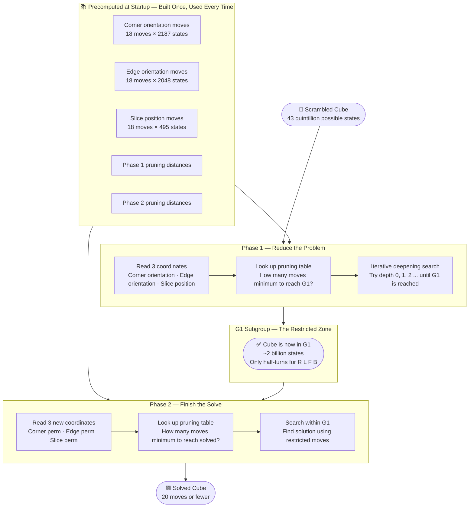
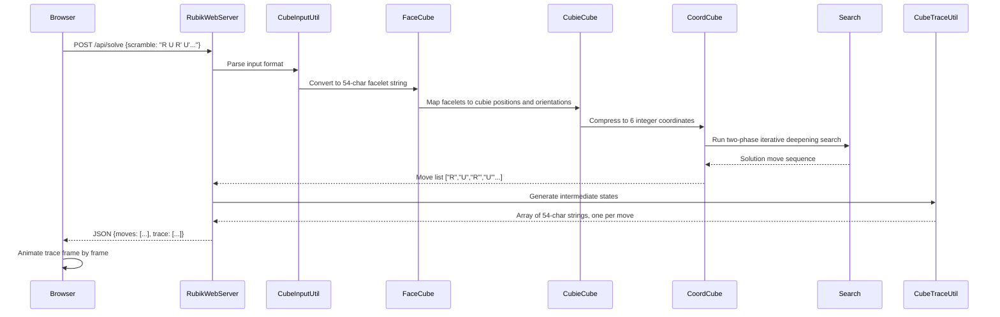
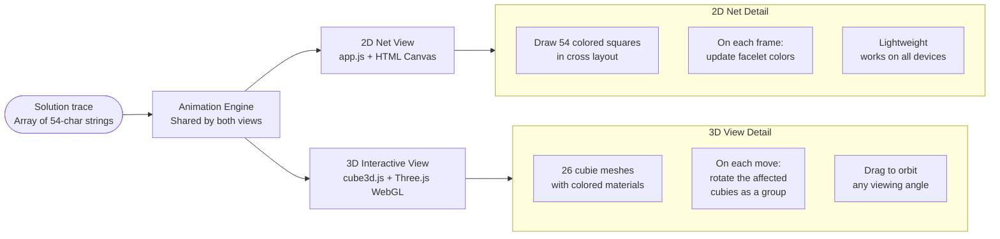

<div align="center">

# Rubik's Cube Solver

*Any scramble. 20 moves or fewer. Solved in real time.*

[](https://rubikscube.fly.dev)
[](https://openjdk.org/)
[](https://threejs.org)
[](https://docker.com)
[](LICENSE)

</div>

<br>

There are very few objects in the world that are simultaneously so simple in description and so incomprehensibly complex in practice. A Rubik's Cube is just six faces, each of nine colored tiles, and you have to get all nine tiles on each face to match. That is the entire problem statement. A child can understand it in thirty seconds. And yet it has over **43 quintillion** distinct scrambled configurations — 43,252,003,274,489,856,000 to be exact — and most people who pick one up find themselves completely lost within a minute.

In 2010 that question was answered definitively. No matter how scrambled a Rubik's Cube is, it can always be solved in **20 moves or fewer**. That number became known as God's Number. The algorithm that gets there efficiently — not by brute force, but by intelligent search through a structured decomposition of the problem — is called **Kociemba's Two-Phase Algorithm**. It is the algorithm at the heart of this project.

This is the story of how that algorithm was implemented from scratch in Java, wrapped in a full-stack web interface with live 2D and 3D visualization, and deployed as a public service that anyone can use from a browser.

<br>

---

## What This Actually Does

Before getting into how it works, here is the simplest possible description of what you are looking at.

You have a Rubik's Cube. Maybe you scrambled it yourself. Maybe someone handed it to you in a hopeless state. You describe that state to this tool — either by typing the sequence of moves that scrambled it, or by uploading a color grid showing every face — and within milliseconds it gives you back a step-by-step solution of at most 20 moves. You can watch the solution play out on an interactive 3D cube you can rotate with your mouse, or on a flat 2D diagram showing all six faces at once. Every step is animated. Every move is labeled.

That is the product. The rest of this document is the story of how it was built.

<br>

---

## The Scale of the Problem

Most people understand that a Rubik's Cube is hard. But the number 43 quintillion is so large it stops feeling real. Here is a way to feel it.

If you started with a solved cube, made one random move per second, and wrote down every unique state you visited without ever repeating one, it would take you **1.4 trillion years** to visit every possible configuration. The universe is only 13.8 billion years old. You would need about 100 universes worth of time.

Brute force — just trying every possible sequence of moves until you find one that works — is completely impossible. Even the fastest computer on Earth could not search that space in any reasonable time. The only way to solve a Rubik's Cube programmatically is to be smarter than brute force. That requires an algorithm that understands the *structure* of the problem and uses that structure to skip enormous portions of the search space entirely.

```
43,252,003,274,489,856,000  possible cube states
                        20  moves needed to solve any of them
              milliseconds  time this solver takes
```

Getting from the first number to the second, in the third amount of time, is what this project is about.

<br>

---

## The Algorithm: Explained Two Ways

### For Everyone

Imagine you are trying to navigate a massive city you have never been to before. The city has 43 quintillion buildings and you need to get to one specific building: the solved cube. If you just start walking randomly, you will never arrive. You need a map.

Kociemba's algorithm works by splitting the journey into two stages. In the first stage, you are not trying to reach your destination. You are trying to reach a specific *neighborhood* — a much smaller part of the city that has only 2 billion buildings instead of 43 quintillion. That neighborhood has a name: G1. Getting into G1 is like getting into the right district of the city. You are not done yet, but you have eliminated 99.99% of the wrong directions.

In the second stage, you navigate *within* that neighborhood to your final destination. Because the neighborhood is much smaller, this search is tractable. You find the solved cube quickly.

The trick that makes both stages fast is a precomputed cheat sheet built at startup. Before the solver ever sees a single scramble, it builds a set of lookup tables that answer the question: "from where I am right now, what is the minimum number of moves I still need?" With that cheat sheet in hand, the search can prune dead-end paths immediately instead of exploring them — which is the difference between milliseconds and hours.

### For Engineers

Kociemba's algorithm operates on the cube's symmetry group G and decomposes the search into two phases using nested subgroups.

**Phase 1** searches the full group G for a short move sequence that brings the cube into the subgroup G1, defined as all states reachable via the move set `{U, D, R2, L2, F2, B2}`. It uses three integer coordinates to describe position relative to G1 without fully specifying cube state: corner orientation (2187 values), edge orientation (2048 values), and UD-slice edge position (495 values). An iterative-deepening A* search uses precomputed pruning tables over these coordinates to find a Phase 1 solution efficiently.

**Phase 2** operates entirely within G1 using the restricted move set. Three Phase 2 coordinates describe state: corner permutation (40320 values), non-slice edge permutation (40320 values), and UD-slice edge permutation (24 values). Phase 2's state space is roughly 40,000 times smaller than the full cube.

The algorithm iterates over Phase 1 solutions of increasing depth, running Phase 2 on each result, until a combined solution within the target depth is found.



<br>

---

## How the Code Sees the Cube

### For Everyone

A Rubik's Cube looks like a physical object to you. But a computer has no eyes. To make the cube computable, the code has to describe it using numbers. The challenge is that the same physical cube can be described at three completely different levels of abstraction, and each level serves a different purpose.

Think of it like describing a city. You could describe it as a satellite photo (the colors you see), as a street map (which block is where), or as GPS coordinates (pure numbers). Each description is of the same city, but each is useful for different tasks. The satellite photo tells you what it looks like. The street map tells you how to navigate. The GPS coordinates are what you actually pass to a routing algorithm.

The cube has the same three levels — and the code has to translate cleanly between all three.

### For Engineers

The codebase implements three representation layers with clean bidirectional conversion:

```mermaid
flowchart LR
    subgraph Layer1 ["👁️ What a Human Sees"]
        F["FaceCube\n54 colored squares\nOne per tile on the cube"]
    end

    subgraph Layer2 ["🧩 What the Cube Is Made Of"]
        C["CubieCube\n8 corner pieces + 12 edge pieces\nEach has a position and an orientation"]
    end

    subgraph Layer3 ["🔢 What the Algorithm Needs"]
        K["CoordCube\n6 integers\nEach encodes one property of cube state"]
    end

    Input(["You type a scramble\nor upload a color grid"]) --> Parse["CubeInputUtil\nNormalise any input format"]
    Parse --> Layer1
    Layer1 -->|"Which piece is in which slot?"| Layer2
    Layer2 -->|"Compress into searchable numbers"| Layer3
    Layer3 --> Search["Search.java\nKociemba algorithm runs here"]
    Search --> Trace["CubeTraceUtil\nReplay solution move by move"]
    Trace --> Animation(["Browser shows\nstep-by-step animation"])
```



**Layer 1: FaceCube** is the human view. Fifty-four colored squares in a fixed order — 9 per face, 6 faces. This is what you see when you look at the cube. It is easy to understand but useless for mathematical search.

**Layer 2: CubieCube** is the physical view. A real cube has 8 corner pieces and 12 edge pieces. Each piece has a *position* (which slot it is sitting in) and an *orientation* (which way it is twisted or flipped). This representation captures the actual mechanics of what happens when you turn a face: a specific set of pieces rotates and changes orientation.

**Layer 3: CoordCube** is the algorithmic view. Six integers, each encoding one measurable property: how twisted are the corners overall, how flipped are the edges, where are the four middle-layer edges, how permuted are the corners, how permuted are the non-middle edges, how arranged are the middle edges within their layer. These six numbers are what the search algorithm actually operates on.

Getting the translations between these three layers correct — without losing information, without introducing bugs — was one of the most careful parts of the implementation.

<br>

---

## How a Request Moves Through the System

### For Everyone

When you type a scramble and click Solve, something travels from your browser through several layers of code and comes back as an animation. Here is what actually happens in that journey.

Your browser sends the scramble to a small web server running in Java. That server hands it to a parser that figures out what kind of input it is. The parser converts whatever format you gave into a standard internal description. That description flows through three translation layers until it becomes a set of abstract numbers the search algorithm can work with. The algorithm finds a solution, and the system then works backwards to generate every intermediate state of the cube — one per move — so your browser can animate the solve step by step. The whole round trip takes milliseconds.

### For Engineers



The server is pure Java 17 with no external frameworks. It binds to the port specified by the `PORT` environment variable, making it compatible with Fly.io, Railway, Render and any other cloud platform that injects port via environment. If the port is taken it tries the next one up to ten times, which makes local development frictionless.

<br>

---

## The Two Ways to See It

### For Everyone

Once the solver returns a solution, your browser renders it in one of two ways. You can switch between them instantly.

The **2D view** unfolds the cube like a cardboard box, laying all six faces flat in a cross shape. Every colored tile is visible at once. As the solution plays, tiles hop between faces and you can watch exactly which pieces are moving and where they end up. It is the clearest way to follow the logic of the solution.

The **3D view** shows the actual cube rotating in space. You can spin it with your mouse, look at it from any angle, and watch each face turn as a smooth animation. It is the most satisfying way to watch a solve — the same feeling as watching someone's hands work through the solution in real life, but in slow motion and from any direction you choose.

### For Engineers



The 3D view builds the cube from 26 individual Three.js mesh objects, one per visible cubie. Each face has a `MeshLambertMaterial` with the standard color scheme: white for U, red for R, green for F, yellow for D, orange for L, blue for B. Face turns are implemented by temporarily grouping the nine relevant cubies into a `THREE.Group`, rotating the group by 90 or 180 degrees over a configurable duration using `requestAnimationFrame`, then dissolving the group and updating the individual mesh transforms.

<br>

---

## The 40 Test Cases

### For Everyone

How do you know the solver is actually correct? Saying it finds a short move sequence is not enough — you also need to verify that applying that sequence to the scrambled cube actually produces a solved cube. For every single test case.

The project includes 40 different scrambles covering the full range: easy scrambles, nearly impossible scrambles, scrambles specifically designed to stress-test unusual situations in the algorithm, and scrambles that are just barely different from solved. Every solution was verified by applying it to the scramble and checking that the result matched a fully solved state.

### For Engineers

Each test file is a 9-row 12-column color grid using characters W, R, G, Y, O, B for the six faces. The `buildColorMap()` function in `Solver.java` reads the center facelet of each face to construct a dynamic character-to-face mapping, making the test files format-agnostic.

Verification is deterministic: a correct solution applied to its scramble must produce the canonical solved facelet string `UUUUUUUUU RRRRRRRRR FFFFFFFFF DDDDDDDDD LLLLLLLLL BBBBBBBBB`. Any deviation is a definitive bug signal in either the move application logic or the facelet-to-cubie conversion.

<br>

---

## What Building This Actually Taught

Four things became clear that go well beyond solving a puzzle.

**Precomputation is underrated.** The solver finds solutions in milliseconds, but the reason it can do that is because it spent time at startup building lookup tables that encode millions of precomputed distances. Without those tables the same search would take hours. The insight is that slow preparation and fast queries are often a better tradeoff than trying to do everything at query time. This is the same principle behind database indexes, DNS caches and compiled regular expressions.

**Representation is half the algorithm.** The same physical cube can be described as a color grid, as physical piece positions, or as abstract integer coordinates. The algorithm only works efficiently in the third representation. None of the mathematical elegance of the two-phase search would be usable if the cube was stuck in the first representation. The translation layers are not boilerplate — they are load-bearing.

**Clean separation lets things change.** The Java backend is a pure REST API. The 3D view was rebuilt from scratch replacing an earlier canvas-based approach with Three.js, and not a single line of Java changed. When the algorithm is isolated from the interface, the interface can evolve freely. Architecture decisions made early determine how expensive later changes are.

**Solved before does not mean trivial to build.** Kociemba's algorithm is a known solution to a known problem. There are implementations of it in multiple languages. But implementing it from scratch reveals how much engineering is packed into a two-sentence description. The pruning tables, the coordinate transformations, the two-phase orchestration, the representation conversions, the animation trace, the input parsing — each piece required real design and real debugging. The fact that something has been done before is not a guide to how hard it is to do.

<br>

---

## Running It

**Online:** [rubikscube.fly.dev](https://rubikscube.fly.dev) — may take a few seconds to wake from cold start on the free tier.

**Windows:**
```bat
git clone https://github.com/Sahibjeetpalsingh/RubiksCube-Solver-Java.git
cd RubiksCube-Solver-Java
run.bat
```

**Mac and Linux:**
```bash
git clone https://github.com/Sahibjeetpalsingh/RubiksCube-Solver-Java.git
cd RubiksCube-Solver-Java
chmod +x run.sh && ./run.sh
```

**Docker:**
```bash
docker build -t rubiks-solver .
docker run -p 8080:8080 rubiks-solver
```

**Manual build:**
```bash
mkdir -p bin
javac -d bin src/*.java
java -cp bin RubikWebServer
```

Open [http://localhost:8080](http://localhost:8080). Type a scramble in standard notation like `R U R' U' R' F R2 U' R'`, or drag any `.txt` file from the `testcases/` folder onto the page. Click Solve.

<br>

---

## Project Structure

```
RubiksCube-Solver-Java/
├── src/
│   ├── RubikWebServer.java    HTTP server, routing, static files, port management
│   ├── Solver.java            CLI wrapper, file input, solution output
│   ├── Search.java            Kociemba Two-Phase Algorithm — the core solver
│   ├── CoordCube.java         Abstract coordinates and precomputed move and pruning tables
│   ├── CubieCube.java         Physical pieces, positions, orientations, 18 move operations
│   ├── FaceCube.java          54-element color array and conversion to cubie representation
│   ├── CubeInputUtil.java     Parses move notation and 9x12 grids into facelet strings
│   ├── CubeTraceUtil.java     Generates intermediate states for step-by-step animation
│   ├── Color.java             Color enum for the six face colors
│   ├── Corner.java            Corner cubie enum, 8 corners
│   ├── Edge.java              Edge cubie enum, 12 edges
│   ├── Facelet.java           Facelet enum, 54 facelets
│   └── JsonUtil.java          Minimal JSON serialization, no external dependencies
├── public/
│   ├── index.html             Main layout, controls, mode switching
│   ├── styles.css             Responsive styles
│   ├── app.js                 2D net view, canvas rendering, animation
│   └── cube3d.js              3D view, Three.js scene, drag rotation, animation
├── testcases/                 40 scramble files in 9x12 color grid format
├── Dockerfile                 Multi-stage build
├── fly.toml                   Fly.io configuration
├── railway.json               Railway configuration
├── render.yaml                Render configuration
├── run.bat                    Windows one-command compile and run
└── run.sh                     Mac and Linux one-command compile and run
```

<br>

---

<div align="center">

Built by **Sahibjeet Pal Singh** and **Bhuvesh Chauhan**

Kociemba's Two-Phase Algorithm by Herbert Kociemba · 3D visualization via Three.js · Deployed on Fly.io

*Because 43 quintillion states deserve a better solution than trial and error.*

</div>
