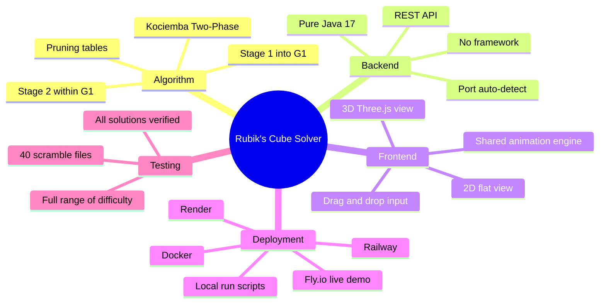

<div align="center">

# Rubik's Cube Solver

*Any scramble. 20 moves or fewer. Solved in milliseconds.*

[](https://rubikscube.fly.dev)
[](https://openjdk.org/)
[](https://threejs.org)
[](https://docker.com)
[](LICENSE)

</div>

<br>

Pick up a Rubik's Cube. Scramble it. Now try to solve it.

Most people get stuck almost immediately — not because they are not clever, but because the problem is genuinely enormous. That small plastic object has **43,252,003,274,489,856,000** possible configurations. If you tried every single one at a rate of one per second, you would still be going long after the sun burned out.

And yet in 2010, mathematicians proved something remarkable: no matter how scrambled a cube is, it can always be solved in **20 moves or fewer**. Every single one of those 43 quintillion states. Twenty moves. That limit became known as God's Number.

This project implements the algorithm that gets there — not by trying everything, but by being genuinely intelligent about what to try. It wraps that algorithm in a web interface where you can hand it any scramble and watch it solve the cube step by step, in real time, in 3D.

<br>

---

## How Big Is the Problem, Really

Before talking about the solution, it helps to feel the actual size of what is being solved. Here is what 43 quintillion looks like in time.

| Speed of search | Time to visit every possible state |
|:---|:---|
| 1 state per second | 1.4 **trillion** years |
| 1 state per millisecond | 1.4 **billion** years |
| 1 state per microsecond | 1.4 **million** years |
| 1 state per nanosecond | 1,400 years |

The universe is 13.8 billion years old. Even at nanosecond speed, brute force would take longer than all of recorded human history — many times over. This is why the algorithm matters. The difference between a naive search and Kociemba's Two-Phase Algorithm is not a speedup. It is the difference between impossible and instant.

<br>

---

## The Core Idea: Shrink Before You Search

The key insight is that you do not need to search all 43 quintillion states. The cube has hidden mathematical structure, and that structure lets you shrink the problem dramatically before searching anything.

Rather than jumping from a scrambled cube to solved in one enormous search, the algorithm splits the journey into two stages.

```
  SCRAMBLED CUBE                  RESTRICTED STATE                SOLVED CUBE
  43 quintillion states    ──►    ~2 billion states        ──►    1 state
  
  Stage 1                         Stage 2
  ─────────────────────────       ─────────────────────────
  Goal    reach G1 subgroup       Goal    reach solved
  Moves   all 18 moves            Moves   restricted set only
  Space   43 quintillion          Space   ~2 billion
  Guided  by pruning tables       Guided  by pruning tables
```

Getting from 43 quintillion down to 2 billion eliminates 99.99% of the search space before Stage 2 even begins. That restriction is doing almost all of the work.

One more ingredient makes both stages fast — **pruning tables** built once when the server starts. These tables answer a single question for any cube state: *what is the minimum number of moves still needed from here?* With that answer available instantly, the search prunes dead-end paths before exploring them. Building the tables takes a few seconds at startup. Every solve after that takes milliseconds.

| Pruning table | States it covers | Used in |
|:---|:---:|:---:|
| Corner orientation distances | 2,187 | Stage 1 |
| Edge orientation distances | 2,048 | Stage 1 |
| Slice edge position distances | 495 | Stage 1 |
| Corner permutation distances | 40,320 | Stage 2 |
| Edge permutation distances | 40,320 | Stage 2 |

<br>

---

## How the Cube Is Described in Code

A search algorithm cannot look at a colored plastic cube. Before the algorithm can run, the cube has to be translated into something a computer can reason about mathematically. That translation happens in three steps.

Think of describing a city. You could describe it as a photograph — what it looks like. Or as a street map — which block is where. Or as GPS coordinates — pure numbers for a routing engine. Same city, three completely different descriptions, each useful for a different purpose. The cube works the same way.

```
  ┌─────────────────────────────────────────────────────────────────┐
  │  LAYER 1 — What you see                                         │
  │  FaceCube                                                       │
  │  54 colored squares, one per tile, recorded in a fixed order    │
  │  "White, white, orange, red, blue..."                           │
  └───────────────────────────┬─────────────────────────────────────┘
                              │  Which piece is in which slot?
                              │  Which way is it twisted?
                              ▼
  ┌─────────────────────────────────────────────────────────────────┐
  │  LAYER 2 — What the cube is made of                             │
  │  CubieCube                                                      │
  │  8 corner pieces + 12 edge pieces                               │
  │  Each has a position and an orientation                         │
  │  Turning a face rotates specific pieces and changes orientation  │
  └───────────────────────────┬─────────────────────────────────────┘
                              │  Compress into
                              │  searchable numbers
                              ▼
  ┌─────────────────────────────────────────────────────────────────┐
  │  LAYER 3 — What the algorithm operates on                       │
  │  CoordCube                                                      │
  │  6 integers, each encoding one measurable property of state     │
  │  Small enough to search, precise enough to be meaningful        │
  └─────────────────────────────────────────────────────────────────┘
```

| Layer | Class | Holds | Why it exists |
|:---:|:---|:---|:---|
| 1 | `FaceCube` | 54 color values in fixed order | Human-readable input — the bridge from what you see to what the code touches |
| 2 | `CubieCube` | 8 corners and 12 edges, each with position and orientation | Physical mechanics — what actually moves and rotates when you turn a face |
| 3 | `CoordCube` | 6 compressed integers | The searchable form — small enough for the algorithm to work with efficiently |

Getting the translation between Layer 1 and Layer 3 correct — without losing information, without an off-by-one error in orientation tracking — was one of the most careful parts of the entire build. A single mistake here produces solutions that look right but leave the cube one twist short of solved.

<br>

---

## What Happens When You Click Solve

You type a scramble. You click the button. Here is the exact journey from your browser to the animation playing back on screen.

| Step | What happens |
|:---:|:---|
| 1 | Browser sends your scramble string to the Java web server |
| 2 | Server identifies the format: move notation or color grid |
| 3 | Input is converted to a 54-character facelet string — Layer 1 |
| 4 | Facelet colors are mapped to physical piece positions — Layer 2 |
| 5 | Piece positions are compressed into 6 integers — Layer 3 |
| 6 | Stage 1 searches for a path into the G1 restricted state |
| 7 | Stage 2 solves the cube from within G1 |
| 8 | The solution move list is returned |
| 9 | Every intermediate cube state is generated, one per move |
| 10 | The full animation trace is sent back to your browser |
| 11 | Browser plays the solution frame by frame |

Steps 1 through 10 take milliseconds. The server runs pure Java 17 with no external framework — just the JDK's own lightweight HTTP server — which keeps the startup fast and the deployment portable across every cloud platform without a code change.

<br>

---

## Watching It Solve: Two Views

Once the solution arrives, you can watch it two ways and switch between them at any point.

| | Flat 2D View | 3D Interactive View |
|:---|:---|:---|
| What you see | All 6 faces unfolded flat in a cross shape | The physical cube floating in space |
| What moves | Colored tiles shift position after each move | Entire face groups rotate smoothly |
| Best for | Following the logic — you see exactly which tile goes where | The experience — it feels like watching someone actually solve it |
| Works on | Everything, including low-end mobile | All modern browsers with WebGL |
| Powered by | HTML Canvas in `app.js` | Three.js WebGL in `cube3d.js` |

Both views run on the same animation trace — the array of cube snapshots generated in step 9 above. A move counter shows where you are. A copy button puts the full solution sequence on your clipboard.

<br>

---

## The Whole System at a Glance



<br>

---

## The 40 Test Cases

Finding a short move sequence is not enough. The solution has to actually work when you apply it to the scrambled cube. Every single time.

| Scramble category | What it stress-tests |
|:---|:---|
| Shallow (1 to 5 moves from solved) | Basic pipeline correctness |
| Medium (6 to 12 moves) | Phase 1 across a range of depths |
| Deep (13 to 20 moves) | Maximum search stress, near God's Number |
| Near-G1 states | Phase 1 termination and edge cases |
| Symmetric scrambles | Orientation tracking under symmetric configurations |

A correct solution applied to its scramble must produce the exact canonical solved state. Any deviation is an unambiguous bug — in move application, in layer translation or in the search itself. All 40 pass.

<br>

---

## What This Project Actually Demonstrates

Solving a Rubik's Cube is the surface. Underneath it, this project is about four ideas that show up in real engineering constantly.

**Representation determines what is possible.** The same cube described three ways enables three completely different operations: input, simulation, search. None is universally correct — each is right for its specific job. Knowing which representation to use for which task, and translating between them without losing information, is a design decision that runs through the entire codebase.

**Precomputation is a real strategy.** The solver is fast at query time because it spent a few seconds at startup building lookup tables. This is the same principle behind database indexes, compiled code and DNS caches. Front-loading work that will be reused many times is often the right architectural choice — not a shortcut, a design.

**Clean separation lets things evolve.** The Java backend is a REST API with no opinions about the frontend. When the 3D view was rebuilt from canvas to Three.js, not a single line of Java changed. Interface and algorithm evolve independently when the boundary between them is clean from the start.

**Prior art is not the same as trivial.** Kociemba's algorithm is documented and implemented in other languages. None of that made building it from scratch easy. The pruning tables, the coordinate system, the two-phase orchestration, the layer translations, the animation trace — each required real design and real debugging. The existence of a solution tells you what to build, not how hard it is.

<br>

---

## Running It

**Online:**
[rubikscube.fly.dev](https://rubikscube.fly.dev) — may take a few seconds to wake on the free tier.

**Windows:**
```bat
git clone https://github.com/Sahibjeetpalsingh/RubiksCube-Solver-Java.git
cd RubiksCube-Solver-Java
run.bat
```

**Mac and Linux:**
```bash
git clone https://github.com/Sahibjeetpalsingh/RubiksCube-Solver-Java.git
cd RubiksCube-Solver-Java
chmod +x run.sh && ./run.sh
```

**Docker:**
```bash
docker build -t rubiks-solver .
docker run -p 8080:8080 rubiks-solver
```

Open [http://localhost:8080](http://localhost:8080). Type a scramble like `R U R' U' R' F R2 U' R'` or drag a file from `testcases/` onto the page. Click Solve.

<br>

---

## Project Structure

```
RubiksCube-Solver-Java/
├── src/
│   ├── RubikWebServer.java    HTTP server, routing, static files
│   ├── Search.java            Kociemba Two-Phase Algorithm
│   ├── CoordCube.java         6-integer coordinates and precomputed tables
│   ├── CubieCube.java         8 corners and 12 edges with all 18 move operations
│   ├── FaceCube.java          54-element color array and piece conversion
│   ├── CubeInputUtil.java     Parse move notation or color grid to facelet string
│   ├── CubeTraceUtil.java     Generate intermediate states for animation
│   └── JsonUtil.java          Minimal JSON without external dependencies
├── public/
│   ├── index.html             Layout and controls
│   ├── app.js                 2D flat view, canvas, animation
│   └── cube3d.js              3D view, Three.js, drag rotation, animation
├── testcases/                 40 scramble files
├── Dockerfile                 Multi-stage build
├── fly.toml                   Fly.io
├── railway.json               Railway
├── render.yaml                Render
├── run.bat                    Windows one-command run
└── run.sh                     Mac and Linux one-command run
```

<br>

---

<div align="center">

Built by **Sahibjeet Pal Singh** and **Bhuvesh Chauhan**

Kociemba's Two-Phase Algorithm by Herbert Kociemba · 3D via Three.js · Hosted on Fly.io

<br>

*Because 43 quintillion states deserve a better answer than trial and error.*

</div>
