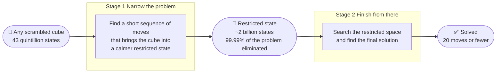
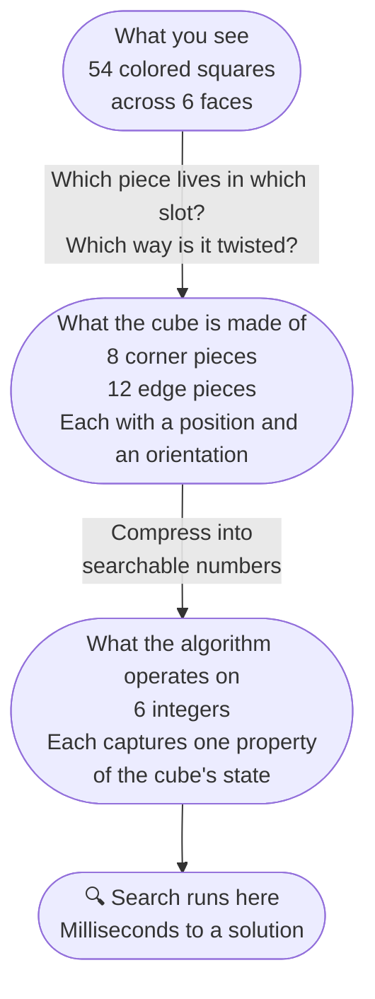
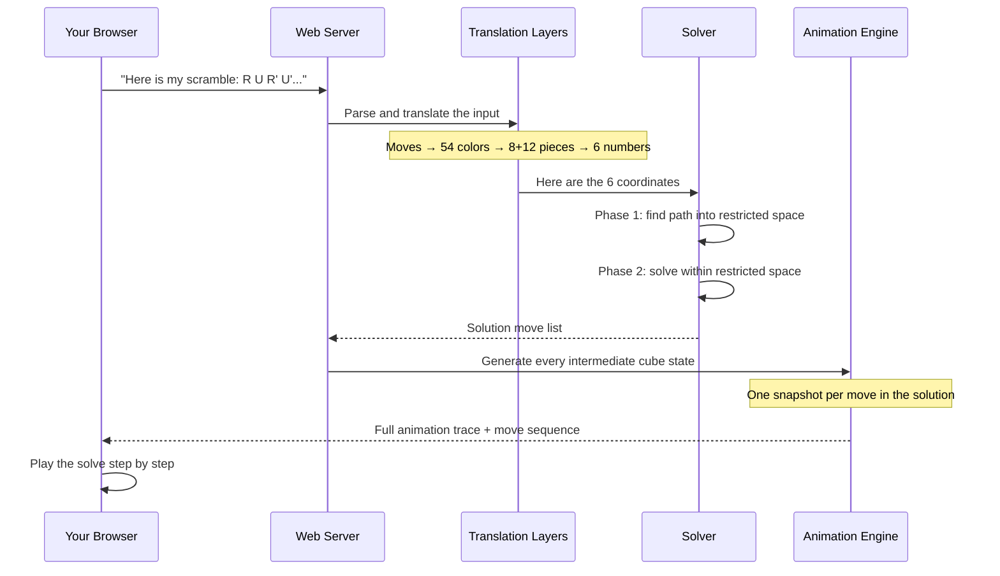

<div align="center">

# Rubik's Cube Solver

*Any scramble. 20 moves or fewer. Solved in milliseconds.*

[](https://rubikscube.fly.dev)
[](https://openjdk.org/)
[](https://threejs.org)
[](https://docker.com)
[](LICENSE)

</div>

<br>

Pick up a Rubik's Cube. Scramble it. Now try to solve it.

Most people get stuck almost immediately — not because they are not clever, but because the problem is genuinely enormous. That small plastic object has **43,252,003,274,489,856,000** possible configurations. If you tried every single one at a rate of one per second, you would still be going long after the sun burned out.

And yet in 2010, mathematicians proved something remarkable: no matter how scrambled a cube is, it can always be solved in **20 moves or fewer**. Every single one of those 43 quintillion states. Twenty moves. That limit became known as God's Number.

This project implements the algorithm that actually gets there — not by trying everything, but by being genuinely intelligent about what to try. It wraps that algorithm in a web interface where you can hand it any scramble and watch it solve the cube step by step, in real time, in 3D.

<br>

---

## The Core Idea

Before a single line of code was written, there was a question worth sitting with: how do you solve something with 43 quintillion possibilities in milliseconds?

The naive answer is to search. Try a move. Then another. Keep going until you find solved. The problem with that approach is that the search tree explodes catastrophically. After just 10 moves you have already visited billions of states. After 20 you are drowning. Random search is not a strategy — it is a way to fail slowly.

The insight behind Kociemba's Two-Phase Algorithm is that you do not need to search all of that space. The cube has hidden structure — mathematical symmetry — and that structure lets you shrink the problem dramatically before you ever start searching.

The idea works like this. Instead of trying to jump from a scrambled cube directly to solved in one search, the algorithm breaks the journey into two stages. First, get the cube into a special restricted state where a large class of the hardest moves are no longer needed. Second, solve it from that restricted state. Each stage searches a space that is orders of magnitude smaller than the full problem.



Going from 43 quintillion down to 2 billion is not just a small improvement. It is the difference between a search that takes the age of the universe and one that takes 50 milliseconds. The restriction is doing almost all of the work.

There is one more ingredient that makes this practical: a set of lookup tables built once at startup. These tables answer a single question for any cube state — *what is the minimum number of moves still needed from here?* With that answer available instantly, the search can skip dead-end paths immediately rather than exploring them. Building those tables takes a few seconds when the server starts. After that, every solve query is fast.

<br>

---

## How the Cube Is Described in Code

Before the algorithm can run, it needs to read a physical scrambled cube and translate it into something a search can operate on. This translation happens in three steps, and each step is necessary.

Imagine you are holding a scrambled cube right now. What you see is colors — orange here, blue there, white on top. That is a human description. It is how you would describe the cube to a friend. But it tells a search algorithm almost nothing useful about the cube's mathematical state.



The first step converts what you see into a list of 54 color values — one per tile, in a fixed order. That is `FaceCube`. It is the bridge between human perception and code.

The second step converts those colors into a description of the physical pieces. A real cube is made of 8 corner pieces and 12 edge pieces. Each corner can sit in any of 8 slots and be twisted in any of 3 ways. Each edge can sit in any of 12 slots and be flipped either way. When you turn a face, a specific set of pieces rotates. `CubieCube` captures this — the actual mechanics of what the cube is doing, not just what it looks like.

The third step compresses all of that physical information into 6 integers. Not because 6 integers are a perfect description — they are not, they leave out some detail — but because 6 integers can be searched. The algorithm lives at this level. `CoordCube` holds these numbers and the lookup tables built from them.

This layered design is not incidental. Each layer exists because it is the right representation for a specific job: the color layer for input, the physical layer for move simulation, the coordinate layer for search. Translating cleanly between them — without losing information, without introducing bugs — was one of the most careful parts of the build.

<br>

---

## What Happens When You Click Solve

You type a scramble. You click the button. Here is exactly what happens next, traced from your browser all the way through the system and back.



The journey from your scramble to the first animation frame takes milliseconds. The server is pure Java with no framework — just the JDK's own lightweight HTTP server — which keeps the deployment footprint small and the startup time fast. The same server runs locally, in Docker, on Fly.io, on Railway and on Render without a single code change.

<br>

---

## Watching It Solve: Two Views

Once the solution is ready, you can watch it play out in two different ways — and switch between them at any point.

The **flat view** unfolds the cube like a cardboard box and lays all six faces out in a cross. Every tile is visible at once. As each move plays, the tiles shift and you can see exactly which pieces are moving and where they end up. It is the clearest way to understand the logic of the solution — you can follow each move as a concrete action on a visible map.

The **3D view** is the cube in space. You can rotate it with your mouse, look at it from any angle, and watch each face turn as a smooth physical rotation. It is how the solution actually feels — the same satisfaction as watching a speedcuber's hands work, but in slow motion, from any direction.

Both views are driven by the same animation engine. When the backend returns a solution, it also returns the full trace — every intermediate state of the cube, one snapshot per move. The animation simply plays through those snapshots at a readable pace, with a move counter running and a button to copy the full solution sequence to your clipboard.

<br>

---

## The 40 Test Cases

A solver is only trustworthy if you can verify it. Finding a short move sequence is not enough — you also need to confirm that applying that sequence to the scrambled cube actually produces a solved state. For every case. Without exception.

The project includes 40 scramble files covering the full range of difficulty: simple scrambles, deeply scrambled states near the theoretical 20-move maximum, scrambles designed to exercise specific corner cases in the two-phase search, and states that are just a few moves away from solved. Every solution was verified by applying it back to the scramble and checking that the result matched a fully solved cube.

That verification step is unambiguous. A correct solution produces one specific string. Any deviation means something is wrong — in the move application logic, in the representation conversion, or in the search itself. Forty files, forty confirmations.

<br>

---

## What This Project Actually Demonstrates

Solving a Rubik's Cube is the surface. Underneath it, this project is about four things that show up in real engineering constantly.

**The right representation changes what is possible.** The same cube, described three different ways, enables three completely different operations: color input, move simulation and mathematical search. None of those representations is universally correct — each is right for its specific purpose. Knowing which representation to use for which job, and building the translations between them correctly, is a fundamental software design skill.

**Precomputation is a legitimate strategy.** The solver is fast at query time because it spent time upfront building lookup tables. That is not a workaround — it is a deliberate architectural choice. The same principle underlies database indexes, compiled code and DNS caches. Front-loading work that gets reused many times is often the right tradeoff.

**Separation between logic and interface pays off immediately.** The Java backend is a REST API with no opinions about what displays the result. When the 3D view was rebuilt from a canvas-based approach to Three.js, not a single line of Java changed. Clean separation means the interface can evolve freely without touching the algorithm. That is not an accident — it was a constraint imposed at the start.

**Known solutions are not trivial solutions.** Kociemba's algorithm is documented. Implementations exist in other languages. None of that made this easier to build from scratch. The pruning tables, the coordinate system, the two-phase orchestration, the representation layers, the animation trace — each piece required real design and real debugging. The existence of prior art describes what to build, not how hard it is to build it.

<br>

---

## Running It

**Online — nothing to install:**

[rubikscube.fly.dev](https://rubikscube.fly.dev) — may take a few seconds to wake from cold start.

**Windows:**
```bat
git clone https://github.com/Sahibjeetpalsingh/RubiksCube-Solver-Java.git
cd RubiksCube-Solver-Java
run.bat
```

**Mac and Linux:**
```bash
git clone https://github.com/Sahibjeetpalsingh/RubiksCube-Solver-Java.git
cd RubiksCube-Solver-Java
chmod +x run.sh && ./run.sh
```

**Docker:**
```bash
docker build -t rubiks-solver .
docker run -p 8080:8080 rubiks-solver
```

Open [http://localhost:8080](http://localhost:8080). Type a scramble like `R U R' U' R' F R2 U' R'` or drag a file from `testcases/` onto the page and click Solve.

<br>

---

## Project Structure

```
RubiksCube-Solver-Java/
├── src/
│   ├── RubikWebServer.java    HTTP server, routing, static files
│   ├── Search.java            Kociemba Two-Phase Algorithm — the solver
│   ├── CoordCube.java         6-integer coordinates and precomputed tables
│   ├── CubieCube.java         8 corners + 12 edges with all 18 move operations
│   ├── FaceCube.java          54 colored squares and conversion to pieces
│   ├── CubeInputUtil.java     Parse any input format into facelet string
│   ├── CubeTraceUtil.java     Generate intermediate states for animation
│   └── JsonUtil.java          Minimal JSON, no external dependencies
├── public/
│   ├── index.html             Layout and controls
│   ├── app.js                 2D flat view, canvas, animation
│   └── cube3d.js              3D view, Three.js, drag rotation, animation
├── testcases/                 40 scramble files for verification
├── Dockerfile                 Multi-stage build
├── fly.toml                   Fly.io
├── railway.json               Railway
├── render.yaml                Render
├── run.bat                    Windows one-command run
└── run.sh                     Mac and Linux one-command run
```

<br>

---

<div align="center">

Built by **Sahibjeet Pal Singh** and **Bhuvesh Chauhan**

Kociemba's Two-Phase Algorithm by Herbert Kociemba · 3D via Three.js · Hosted on Fly.io

<br>

*Because 43 quintillion states deserve a better answer than trial and error.*

</div>
