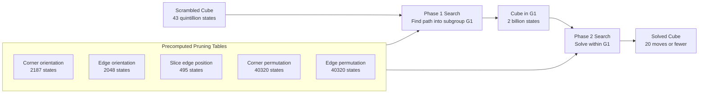
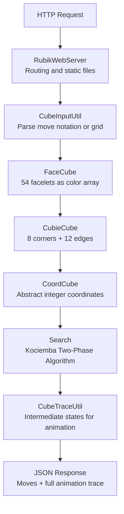
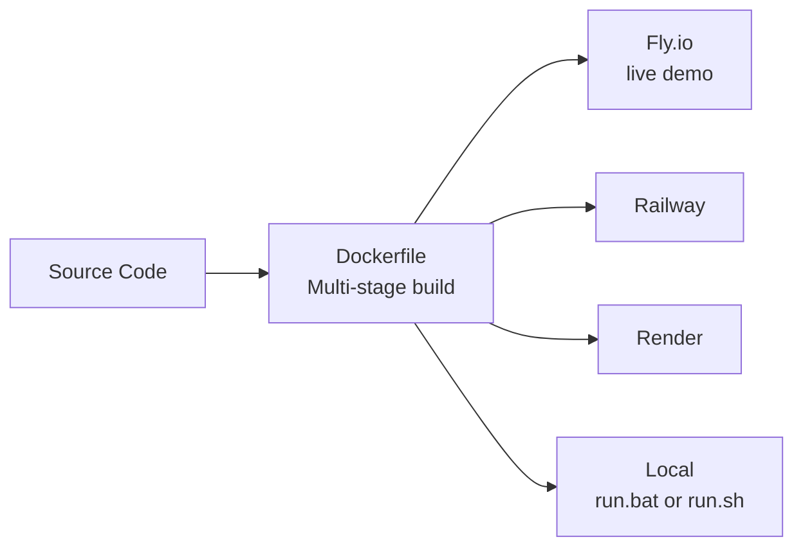

<div align="center">

# Rubik's Cube Solver

*Any scramble. 20 moves or fewer. Solved in real time.*

[](https://rubikscube.fly.dev)
[](https://openjdk.org/)
[](https://threejs.org)
[](https://docker.com)
[](LICENSE)

</div>

<br>

There are very few objects in the world that are simultaneously so simple in description and so incomprehensibly complex in practice. A Rubik's Cube is just six faces, each of nine colored tiles, and you have to get all nine tiles on each face to match. That is the entire problem statement. A child can understand it in thirty seconds. And yet it has a state space of over 43 quintillion distinct configurations — 43,252,003,274,489,856,000 to be precise — and most people who pick one up find themselves completely lost within a minute.

In 2010 that question was answered computationally. No matter how scrambled a cube is, it can always be solved in 20 moves or fewer. That number became known as God's Number. The algorithm that gets there efficiently, not by brute force but by intelligent search through a structured decomposition of the problem, is called Kociemba's Two-Phase Algorithm. It is the algorithm at the heart of this project.

<br>

## The Question Behind the Build

The motivation was a mix of curiosity and challenge. Kociemba's algorithm is well known by name in the cubing community, but understanding it deeply enough to implement it from scratch in Java is a different order of difficulty. The algorithm operates on abstract mathematical representations of cube states that most people never encounter in everyday programming. Its two-phase search structure is elegantly designed but non-obvious.

On top of the algorithmic core there was a full-stack goal: build a web-based interface where you can input any scramble and watch the solution animate step by step in both 2D and 3D, deployed as a public service accessible from any browser without installation. That constraint shaped every architecture decision.

<br>

## Understanding the Algorithm

Before any code was written, the first task was understanding the algorithm at a mathematical level. Kociemba's algorithm is not a simple search. It is a structured decomposition of the cube's symmetry group into two nested subgroups, each of which can be searched much more efficiently than the full 43-quintillion-state space.



**Phase 1** searches for a short move sequence that brings the cube into a special subgroup called G1. G1 is the set of all cube states reachable using only U, D, R2, L2, F2 and B2 moves. What makes this subgroup useful is that it has significantly fewer states than the full cube group, roughly 2 billion versus 43 quintillion, and there are efficient coordinate representations that allow precomputed lookup tables to guide the search.

**Phase 2** takes the cube now in G1 and finds a solution using only that restricted move set. The Phase 2 state space is roughly 40,000 times smaller than the full cube, which makes it tractable to search to completion.

The key insight that makes this practical is that the pruning tables are the expensive part. They take time to build once at startup, but once built they make every subsequent solve query run in milliseconds. This is the classic tradeoff between preprocessing cost and query cost, applied to combinatorial search at scale.

<br>

## The Java Backend

The backend is written in pure Java 17 using no external libraries beyond the JDK's own `com.sun.net.httpserver` package. This was a deliberate choice. Minimizing dependencies reduces the container image size, simplifies deployment, and eliminates dependency management complexity entirely.



| Class | Role |
|:---|:---|
| `RubikWebServer.java` | HTTP routing, static file serving, port management |
| `Search.java` | Core Kociemba Two-Phase Algorithm |
| `CoordCube.java` | Abstract coordinate state and precomputed move and pruning tables |
| `CubieCube.java` | Physical piece positions and orientations with all 18 move operations |
| `FaceCube.java` | 54-element color array and conversion to cubie representation |
| `CubeInputUtil.java` | Parses move notation and 9x12 color grids into facelet strings |
| `CubeTraceUtil.java` | Generates intermediate states for step-by-step animation |
| `JsonUtil.java` | Minimal JSON serialization without external dependencies |

The server exposes three routes. The `/api/state` endpoint accepts a cube description and returns the 54-character facelet string. The `/api/solve` endpoint returns the full solution including the move sequence, the moves as a JSON array, and the complete animation trace. The `/` route serves static files with path traversal protection built in.

<br>

## The Frontend

The frontend is organized around two visualization modes for the same cube state, switchable at any time.

**The 2D Net View** renders the cube as an unfolded net showing all six faces in a cross pattern. Drawn on an HTML canvas, each facelet is a colored square that updates after each move in the solution animation. It is computationally lightweight and works on all devices.

**The 3D Interactive View** uses Three.js to render a photorealistic 3D cube built from 26 visible cubie meshes with colored materials and directional lighting. The user can drag to rotate the view from any angle. When the solution plays, each face move renders as a smooth 3D rotation of the relevant cubies at a readable pace.

Both views share the same animation engine. When the user clicks Solve, the frontend sends the cube state to the backend, receives the move sequence and full trace array, and plays through each frame with a configurable delay. A progress display shows the current move number. A copy button puts the full solution sequence on the clipboard.

Input works two ways. Type a scramble in standard notation like `R U R' U' R' F R2 U' R'` and the backend applies those moves to a solved cube. Or drag and drop any `.txt` file in the 9x12 color grid format directly onto the app.

<br>

## Deployment

A significant part of the engineering effort went into making the project deployable to multiple cloud platforms without code changes.



| Platform | Config File | Notes |
|:---|:---|:---|
| Fly.io | `fly.toml` | Primary deployment, live demo runs here |
| Railway | `railway.json` | Drop-in alternative |
| Render | `render.yaml` | Drop-in alternative |
| Docker | `Dockerfile` | Multi-stage build, minimal final image |
| Local | `run.bat` / `run.sh` | One-command compile and run, no IDE needed |

<br>

## The 40 Test Cases

The `testcases/` folder contains 40 scramble files covering shallow scrambles, deep scrambles close to the theoretical maximum distance, scrambles that trigger specific Phase 1 behaviors, and near-solved states. Each file uses a 9-row 12-column color grid with characters W, R, G, Y, O and B for the six faces.

A correct solution applied to its scramble should always produce a fully solved facelet string. Running all 40 cases and verifying each output was the key validation step during development. Any deviation signals a bug in the move application logic or the facelet-to-cubie conversion.

<br>

## What Building This Taught

Four observations came out of this project that go beyond solving a puzzle.

The first is about precomputation. The algorithm is fast at query time because the expensive work of building pruning tables happens once at startup. Those tables encode millions of precomputed distances. Without them the search would be orders of magnitude slower. Front-loading computation that will be reused many times is often the right tradeoff.

The second is about representation. The same physical cube can be described as a color grid, as cubie positions and orientations, or as integer coordinates in a compressed space. The algorithm only works efficiently at the coordinate level. Building clean conversion logic between all three layers was as important as implementing the search itself.

The third is about architecture. The Java backend implements a pure REST API with no opinions about the frontend. The 3D view was rebuilt from scratch replacing an earlier canvas approach with Three.js without touching a single line of Java. Clean separation pays dividends whenever the interface needs to change while the algorithm stays the same.

The fourth is about solved problems. Rubik's Cube solving is a solved problem in the sense that the algorithm is known. But implementing it from scratch reveals how much engineering is packed into a two-sentence description. The pruning tables, coordinate transformations, two-phase search orchestration, input parsing and animation trace generation each required careful design. Solved before is not the same as trivial to do.

<br>

## Running It

**Online:** [rubikscube.fly.dev](https://rubikscube.fly.dev) — may take a few seconds to wake from cold start on the free tier.

**Windows:**
```bat
git clone https://github.com/Sahibjeetpalsingh/RubiksCube-Solver-Java.git
cd RubiksCube-Solver-Java
run.bat
```

**Mac / Linux:**
```bash
git clone https://github.com/Sahibjeetpalsingh/RubiksCube-Solver-Java.git
cd RubiksCube-Solver-Java
chmod +x run.sh && ./run.sh
```

**Docker:**
```bash
docker build -t rubiks-solver .
docker run -p 8080:8080 rubiks-solver
```

**Manual build:**
```bash
mkdir -p bin
javac -d bin src/*.java
java -cp bin RubikWebServer
```

Open [http://localhost:8080](http://localhost:8080), type a scramble in standard notation or drag a file from the `testcases/` folder, and click Solve.

<br>

## Project Structure

```
RubiksCube-Solver-Java/
├── src/
│   ├── RubikWebServer.java    HTTP server, routing, static files, port management
│   ├── Solver.java            CLI interface, file input parsing, solution output
│   ├── Search.java            Kociemba Two-Phase Algorithm, the core solver
│   ├── CoordCube.java         Coordinate cube, abstract state and pruning tables
│   ├── CubieCube.java         Cubie cube, physical positions, orientations, move ops
│   ├── FaceCube.java          Facelet cube, 54 color array and cubie conversion
│   ├── CubeInputUtil.java     Input parser, move notation and 9x12 grid to facelets
│   ├── CubeTraceUtil.java     Animation trace, intermediate states for playback
│   ├── Color.java             Color enum for the six face colors
│   ├── Corner.java            Corner cubie enum, 8 corners
│   ├── Edge.java              Edge cubie enum, 12 edges
│   ├── Facelet.java           Facelet enum, 54 facelets
│   └── JsonUtil.java          Minimal JSON serialization
├── public/
│   ├── index.html             Main layout, controls, mode switching
│   ├── styles.css             Responsive styles for all viewports
│   ├── app.js                 2D net view, canvas rendering, animation
│   └── cube3d.js              3D view, Three.js scene, drag rotation, animation
├── testcases/                 40 scramble files in 9x12 color grid format
├── Dockerfile                 Multi-stage build
├── fly.toml                   Fly.io configuration
├── railway.json               Railway configuration
├── render.yaml                Render configuration
├── run.bat                    Windows one-command compile and run
└── run.sh                     Mac and Linux one-command compile and run
```

<br>

## Authors

Built by **Sahibjeet Pal Singh** and **Bhuvesh Chauhan**.

Kociemba's Two-Phase Algorithm was originally developed by Herbert Kociemba. The 3D visualization uses Three.js. Deployment runs on Fly.io.

<br>

<div align="center">

*Because 43 quintillion states deserve a better solution than trial and error.*

</div>
